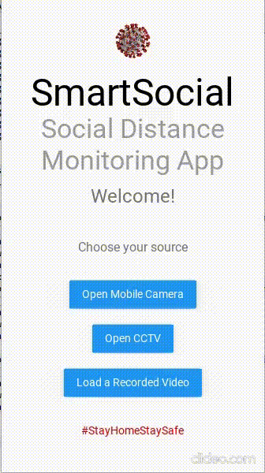
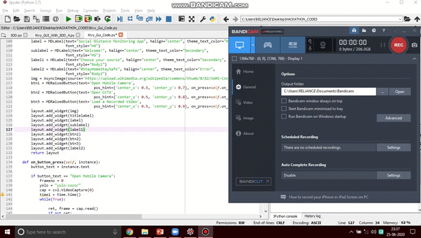

# Social-Distance-Monitoring---SVH2020
This is the Repository that consists of all the codes related to the Designing of our Social Distance Monitoring App for the Smart Virtual Hackathon- 2020 conducted by Sathyabama University, Tamil Nadu.

# Demo - 

### Input Video-

### Output Video -

### App UI Demo -

### Working of the App Demo -

